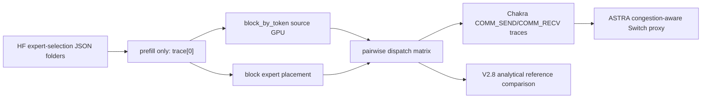

# V2.9 ASTRA-sim Reproduction Attempt

## Bottom Line

ASTRA-sim was actually used in this folder, but only for congestion-aware
1D `Switch` proxy runs generated from Chakra SEND/RECV traces. This ASTRA tree
cannot faithfully model the five target EN/SON/RON modes:

- Folded-Clos ECMP is not an ASTRA analytical topology here.
- 2D torus ECMP is not supported as arbitrary ECMP graph routing.
- RON calibrated / W=4 / oracle require per-request custom degree-4 topologies;
  the analytical parser only supports `Ring`, `Switch`, and `FullyConnected`.
- Congestion-aware analytical backend supports only 1D topology.

Therefore ASTRA-sim cannot replace the V2.8 analytical graph evaluator for final
timing without extending the network backend.

## Pipeline



## ASTRA Support Audit

| Question | Answer |
|---|---|
| Arbitrary topology/link bandwidth/link latency? | No arbitrary topology. YAML supports per-dimension bandwidth/latency, but topology names are limited to `Ring`, `Switch`, `FullyConnected`. |
| Pairwise send/recv traffic? | Yes. Chakra `COMM_SEND_NODE` / `COMM_RECV_NODE` works and calls `front_end_sim_send/recv`. |
| Consume Chakra traces? | Yes. The generated `.et` traces are consumed by ASTRA in this run. |
| Chakra represent dispatch/combine? | Yes, as pairwise send/recv AllToAllv-like traffic. |
| Folded-Clos, 2D torus ECMP, custom RON? | Not faithfully in this ASTRA backend. |
| Per-request topology changes? | Not inside one ASTRA run. Would require separate runs/config swaps plus external accounting. |
| Congestion-aware routing/queueing? | Only for 1D `Ring`/`Switch`/`FullyConnected`; no custom ECMP graph routing. |
| MLSynth/STAGE needed? | No. This is communication-only prefill from real router traces; direct Chakra generation is simpler. |

## Validation

```json
{
  "astra_sim_actually_used": true,
  "byte_conservation_all_passed": true,
  "dispatch_combine_sequential": "ASTRA proxy runs dispatch and combine as separate phases and sums them.",
  "dispatch_equals_combine_all_passed": true,
  "en_400gbps_settings": true,
  "expert_placement": "block",
  "full_reproduction_feasible": false,
  "local_traffic_excluded": true,
  "only_four_specified_workloads": [
    "qwen_mmlu_ml",
    "qwen_livecode",
    "qwen_mmlu_zh_anatomy",
    "deepseek_livecode"
  ],
  "prefill_only_trace0": true,
  "ron_calibrated_first_10pct": "Parsed and counted; topology choice not modeled in ASTRA.",
  "ron_w4_previous4_plus_1us": "Available only in V2.8 reference; not modeled in ASTRA proxy.",
  "son_ron_degree4_1p6tbps": "Not faithfully modeled by ASTRA; ASTRA proxy is 1D Switch at 1.6Tbps.",
  "son_ron_pure_optical_no_eps_fallback": "Not faithfully modeled by ASTRA; preserved only in V2.8 reference rows.",
  "source_policy": "block_by_token"
}
```
