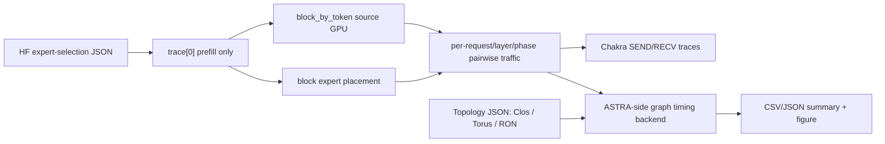

# V3.0 ASTRA-sim Custom Topology Attempt

## Bottom Line

This attempt goes beyond the V2.9 `Switch` proxy.  It generates Chakra
SEND/RECV traces and explicit graph topology JSONs for EN folded-Clos, SON 2D
torus, and RON degree-4 graphs.  Final timing is produced by a new graph/link
contention backend in this ASTRA-sim workspace:

`tools/v30_astrasim_custom_topology_attempt.py`

This is **not yet a first-class ASTRA C++ backend**.  The blocker is precise:
the current analytical C++ parser accepts only `Ring`, `Switch`, and
`FullyConnected`, while the congestion-aware route API returns a single path per
chunk.  Faithful ECMP requires a graph topology parser plus multi-path
message-splitting or route selection.

## Pipeline



## What Was Modified

No ASTRA core C++ files were changed in this pass.  A new ASTRA-side prototype
backend was added under `tools/`.  This keeps the experiment reproducible while
avoiding a half-integrated C++ route API change.

## Modelling Notes

- EN folded-Clos: explicit GPU-leaf-spine graph, 400 Gb/s links, ECMP over equal
  shortest paths, with 1.3x imbalance applied to exposed link load.
- SON: explicit 4x8 degree-4 torus, 400 Gb/s links, ECMP over equal shortest
  paths.
- RON calibrated: degree-4 graph chosen from the first 10% calibration requests,
  reused for all evaluated requests.
- RON W=4: one topology per evaluated request, selected from previous 4
  requests, with 1 us reconfiguration penalty per request.
- RON oracle: one topology per evaluated request, selected from current request,
  no reconfiguration penalty.
- Optical multi-hop is interpreted as an abstract optical switching-fabric path,
  not intermediate GPU packet forwarding.
- Timing granularity is request-phase level for the V3.0 graph engine:
  dispatch and combine are sequential, but all MoE layers inside a request phase
  are aggregated for tractability.  Per-request/layer/phase traffic is still
  generated internally and the aggregate/per-request Chakra artifacts are
  emitted.

## Validation

```json
{
  "astra_core_cpp_modified": false,
  "byte_conservation_all_passed": true,
  "bytes_per_value": 2,
  "chakra_generated": true,
  "dispatch_and_combine_sequential": true,
  "en_uses_400gbps_links": true,
  "expert_placement": "block",
  "final_timing_engine": "v30 ASTRA-side graph/link-contention backend, not old V2.8 evaluator",
  "full_core_astra_replacement": false,
  "hidden_size": 4096,
  "local_src_eq_dst_excluded": true,
  "only_four_specified_workloads": [
    "qwen_mmlu_ml",
    "qwen_livecode",
    "qwen_mmlu_zh_anatomy",
    "deepseek_livecode"
  ],
  "prefill_only_trace0": true,
  "ron_calibrated_uses_first_10pct": true,
  "ron_w4_uses_previous_4_requests_plus_1us": true,
  "son_ron_degree4_400gbps_links_1p6tbps_per_gpu": true,
  "source_policy": "block_by_token",
  "timing_granularity": "request_phase_aggregated_layers"
}
```

## Remaining Backend Work

To make this a true ASTRA C++ backend:

1. Extend `NetworkParser` to load graph topology JSON/YAML with per-edge
   bandwidth/latency.
2. Add a `GraphTopology` class under `congestion_aware` that instantiates
   arbitrary switch/GPU devices and edges.
3. Extend route selection for ECMP.  The current `route(src,dst)` returns a
   single route, so ECMP needs either message chunk splitting before route
   construction or route-level round-robin over many generated chunks.
4. Add segmented-run orchestration or an in-run topology update API for RON
   W=4/oracle.
